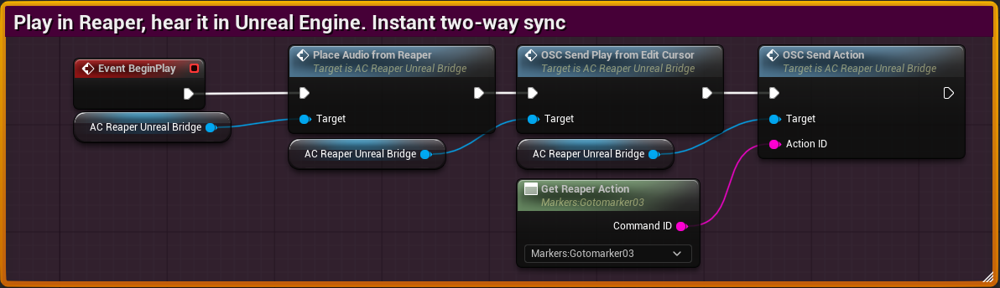

# ReaperUnrealBridge

**Play in Reaper, hear it in Unreal Engine. Instant two-way sync**

Prototype and test your audio from Reaper directly inside Unreal Engine in real time. Add one component to any Actor, hear Reaper's output spatialized in-engine with your existing SoundClass and Attenuation settings, and trigger Reaper actions from Blueprint. No file exports. No round-trips. Just play.

<!-- PLACEHOLDER: Replace with your banner image -->


<!-- Badges -->


---

## Table of Contents

- [How It Works](#how-it-works)
- [Quick Install](#quick-install)
- [Setup in Reaper](#setup-in-reaper)
- [Setup in Unreal: The One Component You Need](#setup-in-unreal-the-one-component-you-need)
- [Example: Weapon Fire](#example-weapon-fire)
- [Key Assets](#key-assets)
- [Requirements](#requirements)
- [FAQ](#faq)
- [Engine Compatibility](#engine-compatibility)
- [Precompiling Binaries (Optional)](#precompiling-binaries-optional)
- [Architecture](#architecture-for-the-curious)
- [Repository Structure](#repository-structure)
- [License](#license)

---

## How It Works

<!-- PLACEHOLDER: Replace with a flow diagram image -->


1. **Unreal triggers Reaper** — An event fires in your game (weapon shot, door open, anything). The plugin sends an OSC message telling Reaper to play.
2. **Reaper plays, audio routes back** — Reaper's output goes through a virtual audio cable (e.g. VB-Cable), which Unreal captures as microphone input.
3. **Unreal spatializes it** — The captured audio is wrapped in Unreal's 3D audio system using your existing SoundClass and Attenuation settings.

You keep Reaper's processing, mixing, and sound design. Unreal handles the spatialization, game logic, and audio classes. Both do what they're good at.

### Why ReaperUnrealBridge?

- No file exports or imports — hear changes in Reaper instantly inside Unreal
- One component on any Actor — no engine config, no Game Instance changes
- Reuses your existing SoundClass and Attenuation — no audio setup from scratch
- Trigger Reaper actions from Blueprint (play, stop, go to marker, run custom actions)

---

## Quick Install

### Step 1 -- Make sure your project has C++ source

If your project already has a `Source/` folder, skip to Step 2.

Blueprint-only projects cannot compile plugins. To add source:

1. In the editor: **Tools > New C++ Class**.
2. Choose any parent class (or **None**) and click **Create Class**.
3. When prompted, let Visual Studio (or Rider) open and build. The project now has a `Source/` folder and can compile plugins.

### Step 2 -- Add the plugin via Plugin Directories

1. In the editor: **Edit > Plugins**.
2. At the top left, click the folder icon (**Plugin Directories**).
3. Add a new entry and set the path to the folder that **contains** the `ReaperUnrealBridge/` plugin folder. For example, if the plugin is at `C:\MyPlugins\ReaperUnrealBridge\`, add `C:\MyPlugins\` as the directory.
4. Restart the editor. The plugin compiles on first load.
5. Go to **Edit > Plugins**, search **ReaperUnrealBridge**, and make sure it's enabled.

No project settings, no Game Instance setup.

---

## Setup in Reaper

To hear Reaper in Unreal, Reaper's output has to go to a virtual device that Unreal can capture as "microphone" input. The simplest way for most people is VB-Cable (free): https://vb-audio.com/Cable/

1. In Reaper: **Preferences > Device**. Set **Audio output** to **CABLE Input**.
2. In Windows Sound settings, set your **microphone (input)** to **CABLE Output**. Reaper's output is now what Unreal sees as the mic.

If you also want Unreal to trigger actions in Reaper (play, stop, go to marker, etc.):

1. **Preferences > Control/OSC/web**. Click **Add**.
2. Use something like:
   - **Control surface mode:** OSC (Open Source Control)
   - **Device name:** ReaperUnrealBridge
   - **Pattern config:** Default
   - **Mode:** Local Port
   - **Local listen port:** 8010 (or any free port)
   - **Allow binding messages to REAPER actions and FX learn:** enabled
3. Note your machine's local IP and the port; you'll need them in Unreal.

---

## Setup in Unreal: The One Component You Need

The heart of the plugin is **AC_ReaperUnrealBridge**. It's a Blueprint component. Add it to the Actor that should drive Reaper (e.g. your weapon, your vehicle). Everything else in the plugin exists to support this component.

<!-- PLACEHOLDER: Replace with a screenshot of the component in the editor (Content Browser or Details panel) -->


### Where to Find It

In the Content Browser, expand **Plugins > ReaperUnrealBridge Content**. You'll see the main asset **AC_ReaperUnrealBridge** (Blueprint Class) and the runtime actor **BP_AudioCapture**. The `HelperAssets` and `OSC` folders contain supporting assets (materials, concurrency, data tables, structs, etc.).

### Settings (Variables)

On **AC_ReaperUnrealBridge**, under **Variables > Settings**:

| Variable | Type | What to set |
|----------|------|-------------|
| **OSC Ip Adress** | String | The IP you noted from Reaper (often your PC's local IP). |
| **OSC Port** | Integer | The port you set in Reaper (e.g. 8010). |

Set these once and the component can talk to Reaper.

### Functions You Use

From the **AC Reaper Unreal Bridge** component you only need a small set of functions. The component also has other functions used internally (e.g. restoring sound base volume); those are handled for you and you can ignore them.

**Main functions to use:**

| Function | What it does |
|----------|-------------|
| **Place Audio From Reaper** | Spawns the audio source, attaches it to your owner, starts capturing from the virtual cable. Call this when you want to "turn on" Reaper audio for this actor. |
| **Copy Settings From Sound Base** | Copies SoundClass and Attenuation from a Sound Base asset onto the capture. Optional toggle to mute the original sound. |
| **Copy Settings From Audio Component** | Same idea, but from an existing Audio Component (e.g. a reference sound already in the level). |
| **OSC_Send_PlayFromEditCursor** | Sends OSC to Reaper to start playback from the edit cursor. |
| **OSC_Send_Stop** | Sends OSC to Reaper to stop playback. |
| **OSC_Send_Action** | Sends a Reaper action by ID (e.g. go to marker, record). Use the **Get Reaper Action** node to get the command ID from the ReaperActions_DataTable. |

**Optional / advanced:** If you open the component's function list you'll see more (e.g. `RestoreSoundSettings`, `ApplyCopiedSoundSettings`, `SetSoundSettings`, `DebugSounds`, `SpawnActor`, `AttachActorToActor`, `StartStream`, `StopStream`, `OSC_Send`). These are used internally or for edge cases. You can use them if you need finer control, but normal workflows only need the six functions above.

---

## Example: Weapon Fire

<!-- PLACEHOLDER: Replace with a screenshot or GIF of the Blueprint graph or in-game result -->


1. Open **AC_ReaperUnrealBridge**, go to **Variables > Settings**, and set **OSC Ip Adress** and **OSC Port** to match Reaper.
2. In your weapon Blueprint (e.g. `BP_Weapon`), add **AC_ReaperUnrealBridge** as a component.
3. From your firing event (e.g. "Event FiredWeapon"), drag a reference to the **AC Reaper Unreal Bridge** component and call, in order:
   - **Place Audio From Reaper** (spawn and attach the audio, start capture).
   - **Copy Settings From Sound Base** (feed it your existing fire sound asset; check "Mute Source" if you don't want the original to play).
   - **OSC_Send_PlayFromEditCursor** (tell Reaper to play).
   - **OSC_Send_Action** (e.g. "Go to marker 01"). Use the **Get Reaper Action** node and pick something like "Markers: Gotomarker01" to get the Action ID.

When the weapon fires, Reaper plays, and the audio is captured and spatialized at the weapon's location using the same SoundClass and Attenuation as your reference sound.

---

## Key Assets

| Asset | Type | Role |
|-------|------|------|
| **AC_ReaperUnrealBridge** | Blueprint Class | The main component. Add this to your actors; it runs the important commands. |
| **BP_AudioCapture** | Blueprint Class | Runtime audio actor with `AudioCaptureComponent`; spawned by the bridge and attached to your actor. |
| **HelperAssets/CC_AudioCapture** | Sound Concurrency | Limits to one capture at a time so only one Reaper stream plays. |
| **HelperAssets/M_ReaperLogo**, **HelperAssets/ReaperLogo** | Material / Texture | Visual helpers used by the plugin. |
| **OSC/ReaperActions_DataTable** | Data Table | Reaper actions (Command ID, name, category). Used by **Get Reaper Action**. |
| **OSC/DT_Reaper_OSCList** | Data Table | OSC command patterns. Used by **Get OSC Command**. |
| **OSC/STRUCT_ActionIDs** / **OSC/STRUCT_ReaperOSCList** | Structures | Backing data for the data tables. |

---

## Requirements

- **Unreal Engine 5.5+** (tested on 5.5, 5.6, 5.7).
- **Visual Studio** or **Rider** (needed to compile the plugin on first load).
- The **AudioCapture** engine plugin (enabled automatically with this plugin).
- **Reaper** (or another DAW that accepts OSC) on the same machine or network.
- A **virtual audio device** (e.g. VB-Cable) so Reaper's output can be sent into Unreal as capture input.

---

## FAQ

**Why no sound in Unreal?**
Check: (1) Reaper's output is set to the virtual cable. (2) Windows default recording device is the cable output. (3) In Reaper, something is actually playing and the master isn't muted. (4) You called **Place Audio From Reaper** and then **OSC_Send_PlayFromEditCursor** (or the right action) so Reaper is playing when you expect.

**Can I use a different virtual cable, JACK, or hardware routing?**
Yes. Any setup where Reaper's output becomes the device Unreal's AudioCapture uses as "microphone" will work. That includes VB-Cable, ReaRoute, ASIO loopback, or hardware mixers. On interfaces like RME Totalmix you can route more granularly: send only track 1-2 to the device Unreal captures from while you still listen to the full mix in Reaper.

**Can I use more than one AC_ReaperUnrealBridge in the same level?**
Yes. Add the component to as many actors as you need. By default, **CC_AudioCapture** limits playback to one capture at a time, so only one Reaper stream plays at once; the others wait or you can adjust concurrency if you need different behavior.

**OSC from Unreal isn't doing anything in Reaper.**
Confirm **OSC Ip Adress** and **OSC Port** on **AC_ReaperUnrealBridge** match the Control/OSC device in Reaper. If Reaper is on another PC, use that PC's IP and the port you opened there.

**What if I'm on a Blueprint-only project?**
You need to add C++ source first. In the editor: **Tools > New C++ Class**, pick any parent (or None), create the class, and build. After that, the plugin will compile when you restart the editor. See [Quick Install](#quick-install) above.

**Does "Get Reaper Action" list every Reaper action, and can I add custom ones?**
It uses a fixed list in **ReaperActions_DataTable**, not a live dump from Reaper. You can add more actions by editing the Data Table with the right Reaper command IDs. For fully custom OSC (arbitrary address/arguments), the **OSC_Send** function is available for advanced use.

**Can I use the same Reaper project for multiple Unreal projects or levels?**
Yes. Reaper doesn't care which Unreal project or level sends the OSC; it just responds on the IP/port. One Reaper instance can be driven by different Unreal projects or levels. Only one Unreal instance can capture from the cable at a time, so you'd run one at a time or use separate routing per instance.

**Tutorial map?**
There is a Tutorial folder; the level there is still under construction and may not be fully wired yet.

---

## Engine Compatibility

| Engine | Status |
|--------|--------|
| UE 5.5 | Supported |
| UE 5.6 | Supported |
| UE 5.7 | Supported |

The plugin compiles from source against whatever engine version your project uses. No pre-built binaries are needed.

---

## Precompiling Binaries (Optional)

If you want to distribute the plugin without requiring users to have Visual Studio, you can build it once per engine version and ship the binaries.

From a command prompt:

```bat
"C:\Program Files\Epic Games\UE_5.5\Engine\Build\BatchFiles\RunUAT.bat" BuildPlugin ^
  -Plugin="C:\path\to\ReaperUnrealBridge\ReaperUnrealBridge.uplugin" ^
  -Package="C:\path\to\output\Packaged" ^
  -Rocket
```

Adjust the engine path and plugin path. The packaged folder will contain the built plugin with `"Installed": true` set automatically. Binaries are per engine version and per platform.

---

## Architecture (For the Curious)

The plugin is built in layers. **AC_ReaperUnrealBridge** is the main component you use; under the hood it uses:

- **BP_AudioCapture** (Blueprint Actor): Holds the engine `AudioCaptureComponent` and a simple visual represented by the Reaper logo that grows and shrinks in size depending on the volume from Reaper. Spawned at runtime by the component and attached to your actor.
- **C++**: Helpers for copying SoundClass/Attenuation, sending raw OSC over UDP, and editor nodes like **Get Reaper Action** / **Get OSC Command** with searchable DataTable dropdowns.

You don't need to modify any of this for normal use; it's here if you want to understand or extend the plugin.

---

## Repository Structure

```
ReaperUnrealBridge/                          (this repo)
├── ReaperUnrealBridge/                      (the plugin folder)
│   ├── Content/
│   │   ├── AC_ReaperUnrealBridge.uasset     (main component)
│   │   ├── BP_AudioCapture.uasset           (runtime actor)
│   │   ├── HelperAssets/
│   │   ├── OSC/
│   │   └── Tutorial/
│   ├── Source/
│   │   ├── ReaperUnrealBridge/              (Runtime module)
│   │   └── ReaperUnrealBridgeEditor/        (Editor module)
│   └── ReaperUnrealBridge.uplugin
├── docs/
│   └── images/                              (README images go here)
├── ReaperProject/                           (Reaper session files)
├── README.md
└── .gitignore
```

---

## License

See the project license.
